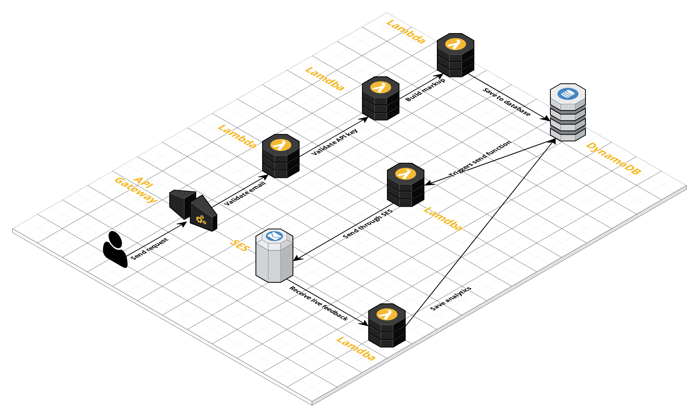

# proliferate

## A work in progress serverless email delivery platform



French documentation can be found [here](draft.md).

## Codebase

`proliferate` is based on the microservice principles. Please refer to [this](https://serverless.com/blog/api-gateway-multiple-services/) if you want to understand the serverless setup. Each service is living on his own with his associated infrastructure resources. Those services could be written in any language if needed.

[Write Serverless Functions Using AWS Lambda And C#
](https://gooroo.io/GoorooThink/Article/17421/Write-Serverless-Functions-Using-AWS-Lambda-And-C/29348)

## Services

### send-email

Input:
```javascript
{
    "api_key": "21e7176c-6051-11e8-9c2d-fa7ae01bbebc",
    "from": "from@example.com",
    "to": [
        "to@example.com"
    ],
    "cc": [
        "cc@example.com"
    ],
    "bcc": [
        "bcc@example.com"
    ],
    "subject": "Example",
    "content": {
        "text": "This is an email",
        "html": "<p>This is an email</p>"
    }
}
```

#### validate-email

This service is used to validate email.

#### validate-api-key

This service is used to validate API keys. Unallowed API keys will not be able to send email from `proliferate`.

## Documentation

#### Deployment
For `dev` stage:

`sls deploy`

For `prod` stage:

`sls deploy --stage prod`

#### Creating a new service

```bash
sls create --template aws-csharp --name {YOUR_SERVICE_NAME} --path ./src/{YOUR_SERVICE_NAME}
cd src/{YOUR_SERVICE_NAME}
.\build.cmd
sls deploy
sls invoke -f {YOUR_SERVICE_NAME}
```

## Support

Please [open an issue](https://github.com/spektrummedia/proliferate/issues/new) for support.

## Contributing

Please contribute using [Github Flow](https://guides.github.com/introduction/flow/). Create a branch, add commits, and [open a pull request](https://github.com/spektrummedia/proliferate/compare).